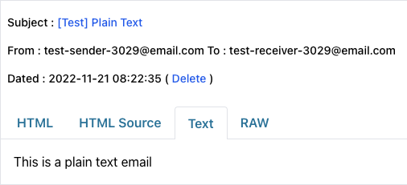
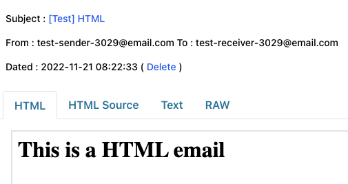
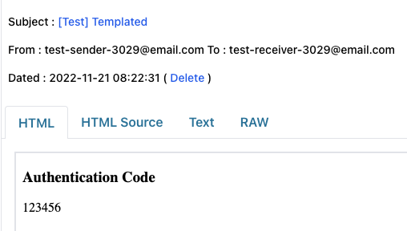

# Spring Mail with FreeMarker Example

This is a Java application that demonstrates the use of Spring Mail with FreeMarker to send plain text, HTML, and templated emails.

## Project Structure

The project follows a standard Maven project structure. The main application code is located in `src/main/java/com/example/mail`. The application entry point is `MailApplication.java`.

The service layer is defined in `MailService.java` and its implementation can be found in `MailServiceImpl.java`.

The application uses FreeMarker templates for email content, located in `src/main/resources/templates`.

## Spring Mail settings

You can configure your smtp server under `src/main/resources/application.yml`. The provided smtp server is provided by WPOven. You can check it out here https://www.wpoven.com/tools/free-smtp-server-for-testing.

## Running the project

To run the project, use Gradle:

```
gradle bootRun
```

Or execute the code with JUnit:

```
gradle test
```

## Examples

#### Plaintext Email



#### HTML Email



#### Templated Email

